# SurveyBot — Execution Flow Map

> Diagramme de reference pour le branchement du code.
> Rendu Mermaid : VS Code (extension "Mermaid Preview"), GitHub, ou https://mermaid.live

```mermaid
flowchart TD
    %% ─────────────────────────────────────────
    %% BOOTSTRAP
    %% ─────────────────────────────────────────
    START([main.py · main&#40;&#41;]) --> ATTACH_CHECK{ATTACH mode?}

    ATTACH_CHECK -- Oui --> ATTACH_FLOW[run_attach_takeover&#40;&#41;\nou run_attach_preselection_takeover&#40;&#41;\n⚑ Pas de lock Postgres\n⚑ Hijack onglet Chrome existant]
    ATTACH_FLOW --> PS_LOOP

    ATTACH_CHECK -- Non --> LOCK[acquire_account_lock_or_exit&#40;&#41;\nPostgres cooldown check]
    LOCK --> BOOT[mark_bot_running&#40;&#41;\ninstall_sigterm_handler&#40;&#41;\nstart_runtime_guard&#40;&#41;\nstart_heartbeat_thread&#40;&#41;]
    BOOT --> DRIVER[launch_driver_or_fail&#40;&#41;\nChrome / Brave via Playwright]

    %% ─────────────────────────────────────────
    %% SESSION INIT
    %% ─────────────────────────────────────────
    DRIVER --> INIT[init_session_and_enter_surveys&#40;&#41;\nlanguage.py · launch.py]
    INIT --> LOGIN[auth_handler.py · login&#40;&#41;\nFill email + password\nWait redirect → /surveys\nVerify session active]
    LOGIN --> SESSION_OK{Session OK?}
    SESSION_OK -- Expired --> SIGTERM[SIGTERM handler\nsoft pause + re-login]
    SIGTERM --> LOGIN
    SESSION_OK -- OK --> CASHOUT_CHECK1[payout.py · check_and_cashout_if_needed&#40;&#41;\nBalance ≥ seuil → cashout Revolut/PayPal]
    CASHOUT_CHECK1 --> BEST[survey_navigator.py · go_to_best_value_survey&#40;&#41;\nFetch ranking TopSurveys\nClick Participer]

    %% ─────────────────────────────────────────
    %% PRESELECTION
    %% ─────────────────────────────────────────
    BEST --> PS_POPUP{Popup préselection\nTopSurveys?}
    PS_POPUP -- Non --> SURVEY_EXEC
    PS_POPUP -- Oui --> PS_LOOP[survey_handler.py · run_survey&#40;&#41;\nMax 15 rounds de qualification]

    PS_LOOP --> PS_Q[question_analyzer.py · get_response_for_question&#40;&#41;\nExtract question + options via DOM\nSend to OpenAI → persona 25 ans, Paris, homme]
    PS_Q --> PS_ACTION{Réponse OpenAI}
    PS_ACTION -- SKIP --> SKIP_SURVEY[Abandon ce survey\nRevenir à go_to_best_value_survey]
    PS_ACTION -- DISQUALIFIED --> SKIP_SURVEY
    PS_ACTION -- Réponse valide --> PS_EXEC[response_executor.py · execute_response& #40;&#41;\nClick checkbox/radio ou fill text\nClick Next]
    PS_EXEC --> PS_CHECK{Résultat?}
    PS_CHECK -- Redirigé vers\nsurvey externe --> SURVEY_EXEC
    PS_CHECK -- Disqualifié --> SKIP_SURVEY
    PS_CHECK -- Timeout 45s --> SKIP_SURVEY
    PS_CHECK -- Suite de questions --> PS_LOOP
    SKIP_SURVEY --> BEST

    %% ─────────────────────────────────────────
    %% BOUCLE PRINCIPALE SURVEY
    %% ─────────────────────────────────────────
    SURVEY_EXEC[survey_executor.py · execute_survey_page&#40;&#41;\nPour chaque page du survey] --> GUARD

    GUARD[difficulty_guard.py · detect_strict_survey&#40;&#41;] --> GUARD_CHECK{Type détecté?}
    GUARD_CHECK -- Captcha reCAPTCHA --> CAPTCHA[captcha_solver.py\nrecaptcha_handler.py\nTry 2Captcha API]
    CAPTCHA --> CAPTCHA_OK{Résolu?}
    CAPTCHA_OK -- Oui --> DOM_WAIT
    CAPTCHA_OK -- Non --> SOFT_RESTART
    GUARD_CHECK -- Drag/Drop\nHold button\nImage eval --> SOFT_RESTART
    GUARD_CHECK -- DataDome --> DATADOME[datadome_handler.py]
    DATADOME --> DOM_WAIT
    GUARD_CHECK -- Aucun --> DOM_WAIT

    DOM_WAIT[Attente stabilité DOM 2s] --> DOM_ANALYZE

    %% ─────────────────────────────────────────
    %% DOM ANALYSIS
    %% ─────────────────────────────────────────
    DOM_ANALYZE[dom_analyzer.py · analyze_dom&#40;&#41;] --> FRAME[dom_frame_selector.py\nSélection meilleur iframe]
    FRAME --> EXTRACTORS{Extracteurs plateforme}

    EXTRACTORS --> EXT_DECIPHER[Decipher / FocusVision\ndom_decipher_*.py]
    EXTRACTORS --> EXT_AYN[AreYouNet\ndom_areyounet_*.py]
    EXTRACTORS --> EXT_QUAL[Qualtrics\ndom_qualtrics_*.py]
    EXTRACTORS --> EXT_OTHER[PureSpectrum · C-Mix\nYouGov · Ipsos · Walr\nConfirmit · IntelliSurvey\n20+ modules]
    EXTRACTORS --> EXT_GENERIC[Fallback générique\nCSS selectors radio/checkbox]

    EXT_DECIPHER & EXT_AYN & EXT_QUAL & EXT_OTHER & EXT_GENERIC --> BLOCKS_CHECK{question_blocks\ntrouvés?}

    BLOCKS_CHECK -- Non --> SCREENSHOT[screenshot_analyzer.py\nVision API fallback]
    SCREENSHOT --> BLOCKS_CHECK2{Blocs trouvés\navec vision?}
    BLOCKS_CHECK2 -- Non --> SOFT_RESTART
    BLOCKS_CHECK2 -- Oui --> PROMPT_BUILD

    BLOCKS_CHECK -- Oui --> PROMPT_BUILD

    %% ─────────────────────────────────────────
    %% AI RESOLUTION
    %% ─────────────────────────────────────────
    PROMPT_BUILD[prompt_builder.py · build_prompt&#40;&#41;\nContext: résumé rolling + 5 derniers Q&A\nFormat: Q &#124; Options &#124; itype]
    PROMPT_BUILD --> OPENAI[OpenAI API · gpt-4o\nPersona + historique + blocs\nOutput: value/////itype////]
    OPENAI --> DISPATCH

    %% ─────────────────────────────────────────
    %% ACTION DISPATCH
    %% ─────────────────────────────────────────
    DISPATCH[action_dispatcher.py · apply_actions&#40;&#41;] --> INPUT_TYPE{Type input}

    INPUT_TYPE --> RADIO[input_radio.py\nclick_radio_by_label&#40;&#41;]
    INPUT_TYPE --> CHECKBOX[input_checkbox.py\nclick_checkbox_by_label&#40;&#41;]
    INPUT_TYPE --> TEXT[input_text.py\nfill_text_input&#40;&#41;]
    INPUT_TYPE --> DROPDOWN[input_dropdown.py\nselect_dropdown_option&#40;&#41;]
    INPUT_TYPE --> SLIDER[input_slider.py\nset_slider_value&#40;&#41;]
    INPUT_TYPE --> MATRIX[input_matrix.py\nfill_matrix_cell&#40;&#41;]

    RADIO & CHECKBOX & TEXT & DROPDOWN & SLIDER & MATRIX --> JS_EVENTS[JS Events dispatch\ninput · change · click\nScroll into view]
    JS_EVENTS --> RECORD[survey_context.py · record&#40;&#41;\nEnregistre Q+A en mémoire\nDéclenche maybe_update_summary&#40;&#41; async]

    %% ─────────────────────────────────────────
    %% NAVIGATION
    %% ─────────────────────────────────────────
    RECORD --> PAUSE1[Pause 1s DOM]
    PAUSE1 --> CTA[cta_handler.py · try_click_navigation_cta&#40;&#41;\nDétection bouton Next/Continuer/Submit\nClick via execute_script]
    CTA --> CTA_FOUND{Bouton trouvé?}
    CTA_FOUND -- Non --> CTA_WARN[Log warning\ncontinue quand même]
    CTA_FOUND -- Oui --> CTA_CLICK[Click]
    CTA_WARN & CTA_CLICK --> PAUSE2[Pause 2s navigation]

    %% ─────────────────────────────────────────
    %% FIN DE PAGE
    %% ─────────────────────────────────────────
    PAUSE2 --> DISQUAL_CHECK{Page = disqualification?\nsorry · non éligible · disqualifi}
    DISQUAL_CHECK -- Oui --> SOFT_RESTART
    DISQUAL_CHECK -- Non --> SURVEY_END_CHECK{Survey terminé?\nPage de remerciement?}
    SURVEY_END_CHECK -- Non, suite --> SURVEY_EXEC
    SURVEY_END_CHECK -- Oui → Survey complété --> CASHOUT_CHECK2

    %% ─────────────────────────────────────────
    %% SOFT RESTART & BOUCLE PRINCIPALE
    %% ─────────────────────────────────────────
    SOFT_RESTART[soft_restart&#40;&#41;\nFerme onglets extra\nNavigate → /surveys] --> CASHOUT_CHECK2

    CASHOUT_CHECK2[payout.py · check_and_cashout_if_needed&#40;&#41;] --> DAILY_CHECK{daily_target.py\nObjectif journalier atteint?}
    DAILY_CHECK -- Oui --> PAUSE_DAY[pause_policy.py\nPause jusqu'à fin de journée]
    PAUSE_DAY --> LOOP_CHECK
    DAILY_CHECK -- Non --> LOOP_CHECK{Cycles restants?\nMax 3 par défaut}
    LOOP_CHECK -- Oui → cycle suivant --> BEST
    LOOP_CHECK -- Non → terminé --> END([FIN · driver.quit&#40;&#41;\nmark_bot_idle&#40;&#41;])

    %% ─────────────────────────────────────────
    %% BACKGROUND THREADS
    %% ─────────────────────────────────────────
    subgraph THREADS [Threads background]
        direction LR
        T1[RuntimeGuard · toutes les 5s\nIdle timeout · Erreurs consécutives\nRuntime max · Earnings target\n→ déclenche soft_restart&#40;&#41;]
        T2[HeartBeat · toutes les 60s\nMet à jour Postgres last_heartbeat_ts]
        T3[HotReload LOCAL only · 0.5s\nRe-import modules modifiés]
        T4[SummaryGen async\nOpenAI rolling summary\naprès N pages]
    end

    %% ─────────────────────────────────────────
    %% STYLES
    %% ─────────────────────────────────────────
    classDef entryExit fill:#1a1a2e,stroke:#e94560,color:#fff,font-weight:bold
    classDef decision fill:#16213e,stroke:#0f3460,color:#a8dadc
    classDef process fill:#0f3460,stroke:#533483,color:#fff
    classDef ai fill:#533483,stroke:#e94560,color:#fff,font-weight:bold
    classDef warning fill:#7b2d00,stroke:#e94560,color:#fff
    classDef thread fill:#1b4332,stroke:#40916c,color:#d8f3dc

    class START,END entryExit
    class ATTACH_CHECK,SESSION_OK,PS_POPUP,PS_ACTION,PS_CHECK,GUARD_CHECK,BLOCKS_CHECK,BLOCKS_CHECK2,CAPTCHA_OK,INPUT_TYPE,CTA_FOUND,DISQUAL_CHECK,SURVEY_END_CHECK,DAILY_CHECK,LOOP_CHECK decision
    class LOCK,BOOT,DRIVER,INIT,LOGIN,CASHOUT_CHECK1,CASHOUT_CHECK2,BEST,PS_LOOP,PS_Q,PS_EXEC,DOM_WAIT,DOM_ANALYZE,FRAME,PROMPT_BUILD,DISPATCH,JS_EVENTS,RECORD,PAUSE1,PAUSE2,CTA,CTA_CLICK,CTA_WARN,PAUSE_DAY,LOOP_CHECK process
    class OPENAI,SCREENSHOT ai
    class SOFT_RESTART,SKIP_SURVEY,CAPTCHA,DATADOME warning
    class T1,T2,T3,T4 thread
```

---

## Index des fichiers cles par etape

| Etape | Fichier(s) |
|---|---|
| Entry point | `main.py` |
| Config / modes | `config.py` |
| Login | `preselection/auth_handler.py` |
| Navigation survey | `preselection/survey_navigator.py` |
| Preselection Q&A | `preselection/survey_handler.py`, `question_analyzer.py`, `response_executor.py` |
| Boucle survey | `Survey/survey_executor.py`, `survey_solver.py` |
| Analyse DOM | `Survey/dom_analyzer.py`, `dom_*.py` (20+ fichiers) |
| Construction prompt | `Survey/prompt_builder.py` |
| Contexte/historique | `Survey/survey_context.py` |
| Dispatch reponses | `Survey/action_dispatcher.py` |
| Handlers input | `Survey/input_radio.py`, `input_checkbox.py`, `input_text.py`, `input_dropdown.py`, `input_slider.py`, `input_matrix.py` |
| Navigation page | `Survey/cta_handler.py` |
| Guard difficulte | `Management/guards/survey_difficulty_guard.py` |
| Guard runtime | `Management/guards/runtime_guard.py` |
| Captcha | `captcha/recaptcha_handler.py`, `datadome_handler.py` |
| Payout | `Cash/payout.py` |
| Etat persistant | `State/account_state.py`, `daily_target.py` |
| Notifications | `Management/notifier.py` |
| Hot reload | `hot_reload/hot_reload.py` |
